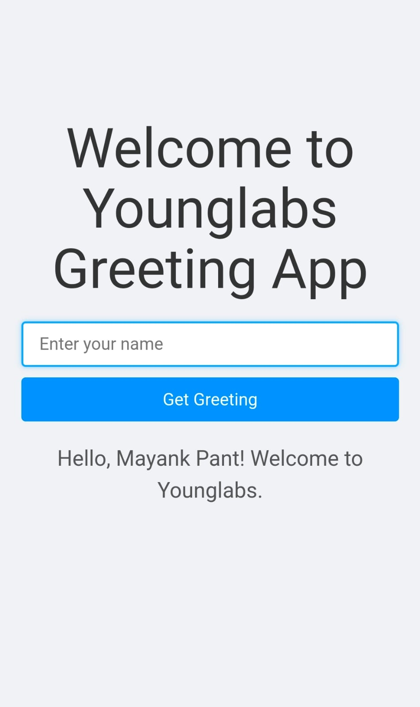

# Project Title

Greeting App

# Project Description 

Welcome to the Younglabs Greeting App!

The Greeting App is a simple yet engaging web application designed to provide a personalized touch to user interactions. By allowing users to input their names, the app generates a custom greeting message, making each user feel recognized and welcomed. This application serves as an excellent starting point for understanding full-stack web development using modern technologies like React for the frontend and Node.js with Express for the backend.

# Key Features 

1. Personalized User Experience: Users receive a unique greeting message based on the name they provide.

2. Responsive Design: The app is optimized for various devices, ensuring a consistent experience on desktops, tablets, and mobile phones.

3. Full-Stack Integration: Demonstrates communication between the frontend and backend using HTTP requests.

4. Easy Deployment: Configured for effortless deployment on platforms like Render and Vercel.

5. Educational Value: A great example for learning or teaching the basics of React, Node.js, and Express.

# Installation 

1. Clone the repository to your local machine:

    git clone https://github.com/your-username/greeting-app.git
    cd greeting-app

2. Install the dependencies for both the frontend and backend:

   Frontend:-
    cd frontend
    npm install

   Backend:-
    cd ../backend
    npm install

3. Running the Application:

   Step 1: Start the Backend Server
   
   In the backend directory:
    npm run start

   Step 2: Start the Frontend Development Server

    npm run dev

# Project Screenshot 
  

# Deployment Link
  https://screening-task.onrender.com/

